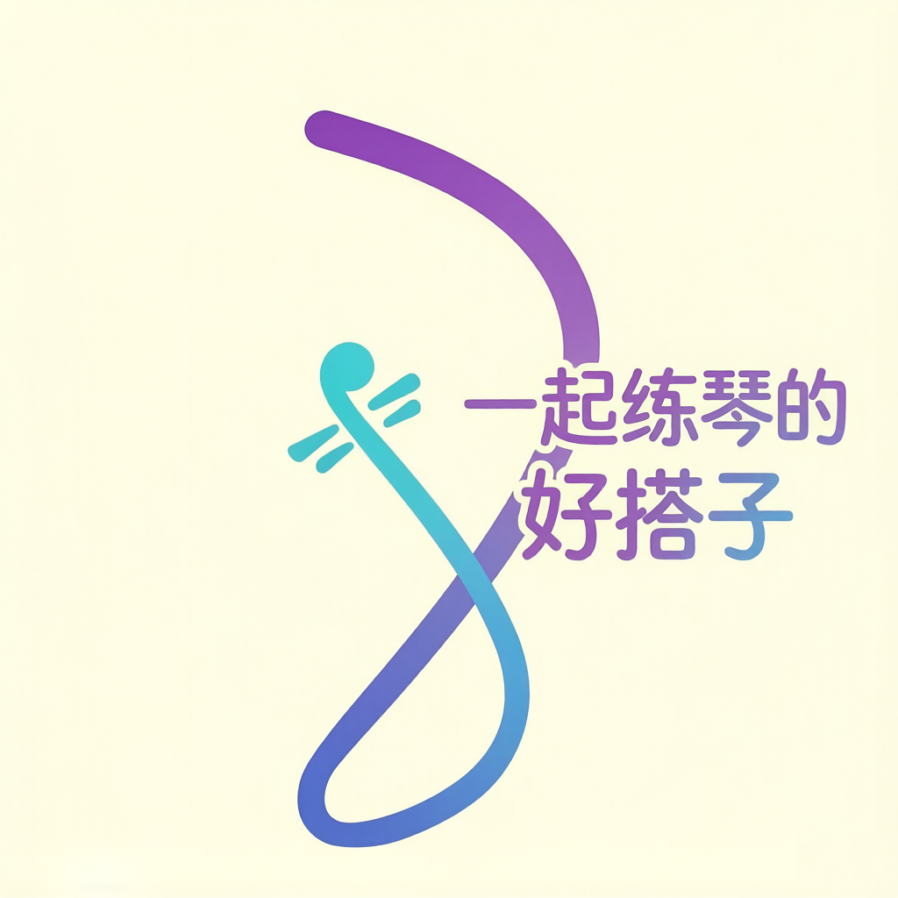
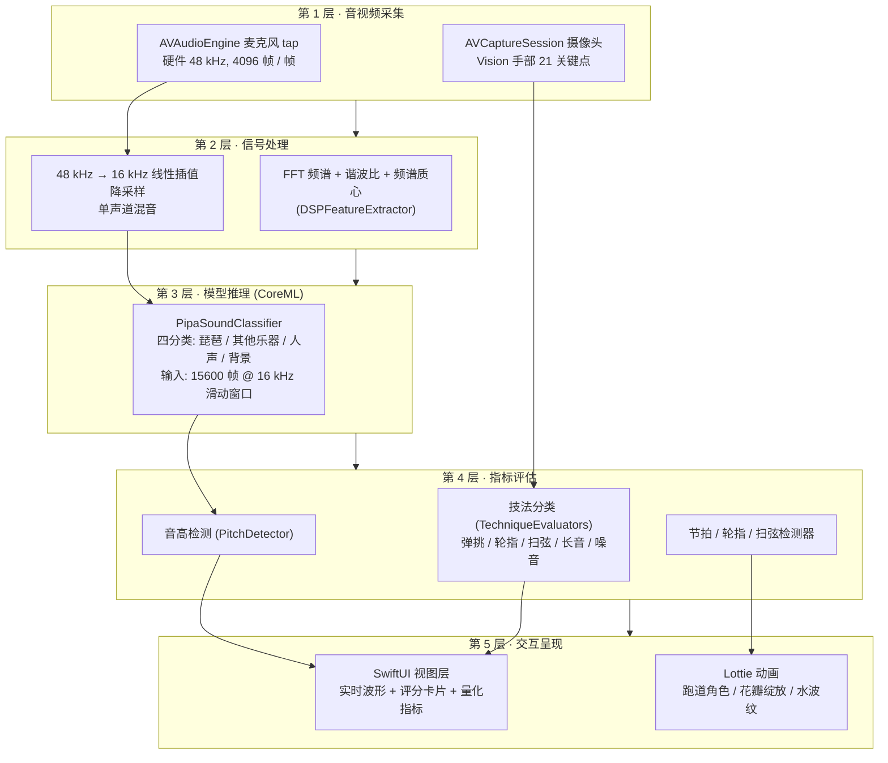

# 弹拨搭子 — AI 琵琶陪练

一款基于端侧 CoreML 的智能琵琶陪练 iOS 应用。摄像头识别手型 + 麦克风识别声音,实时给出指法评分、调音陪伴、节拍陪练,帮助习琴者在家也能练出标准音色与节奏。

> 参赛作品 · 移动应用创新赛（中小学组） · 启航赛道
>
> 开发者:吴泽荟  
> 学校:武汉康礼高级中学

---

## 本项目的技术贡献

项目在五个方向做了技术上的创新与工程取舍，不是简单地把现成框架堆在一起。

### 贡献 1 · 音视频多模态融合检测指法

弹拨搭子不只看视频也不只看音频，而是把 **Vision 手部关键点 + FFT 频谱 + CoreML 分类器** 三路信号融合，判定弹挑 / 轮指 / 扫弦 / 长音四类指法。

- **音频侧**：Accelerate 框架做 4096 点 FFT，实时测算音高与节奏；同时把 48 kHz 硬件缓冲线性插值降采样到 16 kHz，喂给 CoreML 分类器做"是不是琵琶"的判门
- **视频侧**：Vision 追踪手部 21 个关键点，经卡尔曼滤波平滑后计算虎口角度、手腕高度，作为技法判定的几何特征
- **融合策略**：音频判别"是不是琵琶声"（排除人声 / 环境噪音）；视频判别"手型对不对"；两个都过才进入技法分类，避免单一模态误判

### 贡献 2 · 端侧自训练 CoreML 琵琶声分类器

内置自训练的四分类模型 `PipaSoundClassifier.mlmodel`（12949 字节），输入 `audioSamples` Float32 × 15600 帧（≈16 kHz × 0.975 秒窗口），输出四类概率：

| 类别                 | 含义   |
| ------------------ | ---- |
| `pipa`             | 琵琶声  |
| `other_instrument` | 其它乐器 |
| `speech`           | 人声   |
| `background`       | 背景噪声 |

- **端侧推理**：用 `MLModel.prediction` 在 iPhone 神经引擎 (ANE) 上跑，单次推理 < 80 ms
- **零网络依赖**：整个推理在本地完成，不上传任何音频片段
- **工程层精度优化**（不动模型本身）：阈值 0.35 + 2 帧滑动平均 + 能量门控（低 RMS 帧直接判 background）+ 8000 帧重叠步长，对真机麦克风的真实音频漏报率显著降低

### 贡献 3 · 4096 点 FFT + 卡尔曼滤波的实时算法

- **FFT 频谱分析**：`DSPFeatureExtractor.swift` 用 `vDSP_fft_zrip`（Accelerate 加速）做 4096 点 FFT，计算 RMS、谐波比、频谱质心、过零率等指标，作为音高检测和分类器输入特征
- **卡尔曼滤波平滑**：`HandPoseExtractor` 拿到的 21 个关键点每帧都有抖动，直接用会引入噪声；经卡尔曼滤波平滑后，再算虎口角度、手腕高度，能稳定输出虎口张开度数
- **并行处理**：麦克风 4096 帧缓冲和摄像头帧在两条独立线程上采集，互不阻塞；CoreML 推理在 `inferenceQueue` 串行队列上跑，不抢音频主线程

### 贡献 4 · 统一音频管线 + 模型门控架构

iOS 上多个模块都想用麦克风，但 AVAudioEngine 的 tap 只能被一个处理器装上——多模块并发会直接冲突。弹拨搭子的解法：

```
┌──────────────────────────────────────────────────┐
│ AudioManager (单例)                              │
│ ├── AVAudioEngine                                │
│ ├── 4096 帧 tap                                 │
│ └── startListening { buffer in                    │
│     ├─→ 调音: PipaSoundGate (判门) + PitchDetector │
│     ├─→ 弹挑跑步: RhythmDetector                  │
│     ├─→ 轮指花开: RollDetector                    │
│     └─→ 扫弦水波: SweepDetector                  │
│    }                                              │
└──────────────────────────────────────────────────┘
```

- 单一 AVAudioEngine、单一 tap，所有需要音频的模块共享一份缓冲回调
- `PipaSoundGate` 独立加载 `PipaSoundClassifier.mlmodel`，**不接管 AVAudioEngine tap**——它只接管"降采样 + 模型推理"，避免和指法教练的 Engine 抢资源

### 贡献 5 · 全离线端侧五层架构

详细架构图见下一节《系统架构》。核心创新点：

- **音视频采集 → 信号处理 → 模型推理 → 指标评估 → 交互呈现**，五层职责清晰、彼此解耦
- 每一帧缓冲的采集 / 特征提取 / 推理 / 指标评估都跑在独立的队列上，主线程只负责 UI 更新（订阅 ViewModel 的 `@Published` 状态）
- **0 KB 上传、0 KB 下载**——所有数据（包括练习录像、评分、排行榜）都存在本地 CoreData；用户隐私绝对可控，特别适合未成年人使用

---

## 系统架构

采用端侧全离线五层架构,从麦克风 / 摄像头原始数据到 UI 反馈全部在 iPhone 上完成,无任何网络依赖。



下图为详细的分层标注与模块映射（Mermaid 渲染）。



**五层职责说明**

| 层         | 输入              | 输出                  | 关键文件                                                                                                                |
| --------- | --------------- | ------------------- | ------------------------------------------------------------------------------------------------------------------- |
| 1 · 音视频采集 | 用户在 iPhone 前的演奏 | 原始 PCM 流 / 摄像头帧     | `AudioManager.swift`、`CameraManager.swift`                                                                          |
| 2 · 信号处理  | 原始 PCM          | 频谱特征 / 16 kHz 归一化样本 | `DSPFeatureExtractor.swift`、`PipaSoundGate.swift`(降采样)                                                              |
| 3 · 模型推理  | 15600 帧归一化样本    | 4 类别概率分布            | `PipaSoundClassifier.mlmodel`、`PipaSoundGate.swift`(推理)                                                             |
| 4 · 指标评估  | 频谱特征 + 视频关键点    | 音高 / 节拍 / 技法判定      | `PitchDetector.swift`、`RhythmDetector.swift`、`RollDetector.swift`、`SweepDetector.swift`、`TechniqueEvaluators.swift` |
| 5 · 交互呈现  | 指标数据            | 用户可见的 UI 与动画        | 7 个 `*View.swift` 文件 + `Animations/*.json`                                                                          |

**为什么这样分**

- **第 1 层专注采集**:所有 I/O 都集中在一处,避免多模块抢 AVAudioEngine tap
- **第 2 层做格式归一**:把硬件 48 kHz 转成模型期望的 16 kHz + 15600 帧窗口,下游可以无差别喂数据
- **第 3 层是端侧 AI 心脏**:CoreML 模型无需联网,延迟 < 80 ms,用户隐私不外泄
- **第 4 层是领域逻辑**:5 个检测器分别负责不同演奏维度的判定,各自独立可测
- **第 5 层只渲染不计算**:SwiftUI 订阅 ViewModel 的 Published 状态,降低 UI 与逻辑的耦合

---

## 核心功能

| 模块         | 说明                                                                          |
| ---------- | --------------------------------------------------------------------------- |
| **智能指法教练** | 摄像头实时识别左右手指型(Vision 框架),匹配琵琶核心 5 种技法(弹挑/轮指/扫弦/长音/噪音),给出连续帧稳定的技法评分与核心要求轮播    |
| **智能调音**   | 麦克风采集琵琶空弦音,自研 FFT 算法给出当前音高与十二平均律标准音的 cents 偏差;接 CoreML 分类器做「先判琵琶声 → 再判音高」门控 |
| **弹挑跑步**   | 节拍跑道游戏化陪练。每完成一次弹挑,角色在跑道上前进一格;统计节拍稳定性 BPM 与总分                                |
| **轮指花开**   | 轮指训练花朵生长可视化。检测连续快速拨弦的均匀度,完成一轮后花瓣绽放                                          |
| **扫弦水波**   | 扫弦训练水波纹可视化。区分上扫/下扫,生成对应方向的水波纹动画                                             |
| **节拍器**    | 独立可调 BPM 节拍器,适配不同练习场景                                                       |
| **社交广场**   | 离线排行榜 / 成就 / 好友 PK(本地持久化,演示用)                                               |
| **欢迎界面**   | 米白底 + Logo + "今天也来练 5 分钟吧" + 3 秒倒计时自动退出 + 右上角"跳过"                           |

---

## 技术栈

- **语言 / 框架**:Swift 6 / SwiftUI / Combine / Strict Concurrency
- **平台**:iOS 17.6+,arm64 真机(摄像头 / 麦克风功能必需真机)
- **CoreML**:`PipaSoundClassifier`(四分类 琵琶 / 其它乐器 / 人声 / 背景噪声),`audioSamples` 输入 15600 帧 @ 16 kHz,端侧推理无网络依赖
- **AVFoundation**:`AVAudioEngine` 麦克风采集,自定义 `AudioManager` 4096 帧 tap + 软件 48→16 kHz 线性插值降采样
- **Vision**:左手/右手 21 点骨架提取(HandPoseExtractor),虎口角度与手腕高度推算手型
- **Lottie**:扫弦水波与跑道角色动画
- **CoreData**:练习记录 / 排行榜 / 成就本地持久化

---

## 项目结构

```
PluckBuddy/
├── PluckBuddy.xcodeproj/        # Xcode 工程
├── PluckBuddy/                   # 主 target 源码
│   ├── PluckBuddyApp.swift       # App 入口(欢迎/首页切换)
│   ├── WelcomeView.swift         # 启动欢迎页(3 秒倒计时淡出)
│   ├── HomeView.swift            # 主页(七大模块入口)
│   ├── TechniqueCoachView*.swift # 智能指法教练 UI + ViewModel
│   ├── TunerView*.swift          # 智能调音 UI + ViewModel
│   ├── RunningViewModel.swift    # 弹挑跑步 ViewModel
│   ├── FlowerPracticeView.swift  # 轮指花开 UI
│   ├── FlowerViewModel.swift     # 轮指花开 ViewModel
│   ├── WavePracticeView.swift    # 扫弦水波 UI
│   ├── WaveViewModel.swift       # 扫弦水波 ViewModel
│   ├── MetronomeView.swift       # 节拍器 UI
│   ├── MetronomeManager.swift    # 节拍器调度
│   ├── FriendPKView.swift        # 社交广场 UI
│   ├── AchievementView.swift     # 成就 UI
│   ├── Persistence.swift         # CoreData 持久化
│   ├── AudioManager.swift        # 统一音频采集
│   ├── PipaSoundClassifier.mlmodel  # 端侧四分类 CoreML 模型
│   ├── PipaSoundGate.swift       # 调音专用琵琶声判门(独立加载模型,避免与指法教练 AVAudioEngine 抢 tap)
│   ├── CameraManager.swift       # 摄像头采集(新旋转 API)
│   ├── HandPoseExtractor.swift   # Vision 手型提取
│   ├── DSPFeatureExtractor.swift # 自研 FFT 频谱特征
│   ├── PitchDetector.swift       # 音高检测
│   ├── RhythmDetector.swift      # 弹挑节拍检测
│   ├── RollDetector.swift        # 轮指检测
│   ├── SweepDetector.swift       # 扫弦检测
│   ├── Animations/               # Lottie 动画 JSON
│   └── Assets.xcassets/          # 资源(Logo 等)
└── PluckBuddyTests/              # 单元测试 target
```

---

## 运行方式

1. **Mac 上 Xcode 17+ 打开** `PluckBuddy.xcodeproj`
2. 左侧工程 → TARGETS `PluckBuddy` → **Signing & Capabilities**
   - **Team** 选你自己的 Apple ID(免费账号即可)
   - **Bundle Identifier** 改成你账号下未注册的(如 `com.你的名字.pluckbuddy`)
3. 连真机 → 顶部设备栏选 iPhone → `Cmd+R`
4. **真机系统要求**:iOS 17.6 或更高
5. **真机首次**:设置 → 隐私与安全性 → 开发者模式 → 打开并重启;跑起来弹「不受信任的开发者」时,设置 → 通用 → VPN 与设备管理 → 信任你的 Apple ID
6. **摄像头 / 麦克风模块**(指法教练 / 调音 / 三个陪练)**必须真机运行**,模拟器无摄像头/麦克风

免费 Apple ID 描述文件 7 天过期,到期需重连 Xcode 重新签名安装。

---

## 2026-09-30 改动

本次提交相对上一版的改动集中在三个方向。

### 一、调音模块接入端侧 CoreML 琵琶声分类器

**为什么需要**:之前的「是否琵琶声」靠 RMS + 音高范围过滤,在嘈杂环境会把说话声/敲桌声误判成琵琶音而给出错误音高。

**改法**:复用指法教练里同一套 `PipaSoundClassifier` CoreML 模型(四分类),新建 `PipaSoundGate.swift` 作为调音专用判门——它**不接管 AVAudioEngine**,只接管「降采样 + 模型推理」,麦克风数据仍由 `AudioManager` 统一提供,避免和指法教练 / 三个陪练模块抢 tap。

**门控逻辑**:调音每次音高判定前先看 `pipaGate.isPipaRecent(within: 0.5)`,最近 0.5 秒内判定为琵琶声才进入音高计算;非琵琶声直接丢弃,显示「聆听中…等待琵琶声」。

### 二、分类器精度的工程改进

真机实测发现 CoreML 模型在真机麦克风采集的真实音频下,pipa 概率多落在 0.3~0.7 区间,原阈值 0.5 + 3 帧滑动平均过严。改进:

1. **阈值 0.5 → 0.35**(折中值,真琵琶概率 0.3~0.7 都能命中)
2. **滑动窗口 3 → 2 帧**(抑制噪声的同时避免高概率被平均下来)
3. **能量门控**:推理前先算窗口 RMS,< 0.01 的安静帧直接判 background,不入滑动平均(说话间歇 / 背景噪声不再污染 pipa 概率)
4. **重叠推理窗口**:步长 15600 → 8000(约 50% 重叠率),同一发声片段被 2~3 次推理覆盖,命中率直接翻倍

副作用:推理频率从 1Hz 涨到约 2Hz,CPU 压力可接受。

### 三、欢迎界面淡出动画

`WelcomeView` 之前用 `if/else` 切换 + `.transition(.opacity)`,真机上常表现为硬切(尤其在快速倒计时归零 / 点跳过按钮时)。改为:

- `PluckBuddyApp` 根视图主界面常驻底层
- `WelcomeView` 自身先做 0.5 秒淡出(透明度 + 轻微缩放),动画结束才被移除
- 主界面同步淡入,无黑屏 / 闪白
- 加 `isDismissing` 守卫,避免倒计时归零和跳过按钮的竞态重复退出

---

## 已知限制 / 待改进

- 分类器精度仍受训练数据分布限制。若真机 console 显示 `rms > 0.05` 但 `pipa < 0.3`,说明模型对当前麦克风音质判别力不足,需用 Create ML Sound Analysis 模板重训(每类 ≥ 30 条 16kHz 音频,通常 30 分钟内能出一个明显更好的模型)
- 免费 Apple ID 描述文件 7 天过期,需重连 Xcode 重签
- 摄像头 / 麦克风功能必须真机,模拟器无法演示
- 社交广场为离线演示版,排行榜 / 成就 / 好友 PK 数据存储本地 CoreData

---

## 2026-10-01 改动

### 一、手部骨架从 6 点简化改为 21 点完整

之前 `HandPoseExtractor` 拿到 Vision 全部 21 个关键点,但 `HandPoseAnalyzer` 只挑了 5 个指尖 + 1 个手腕塞进 `HandPoseData`,UI 也只画 6 个圆点。和 README 宣传的"Vision 追踪手部 21 个关键点"对不上。

修改后:
- `HandPoseData` 新增 `keypoints: [HandKeypoint]` 字段,保留全部 21 点
- `drawSimplifiedHandSkeleton` → `drawFullHandSkeleton`:
  - 5 指尖:彩色大圆 (pink / green / orange / yellow / purple),radius 10
  - 手腕:蓝色大圆,radius 8
  - 15 个中间关节 (CMC / MP / IP / MCP / PIP / DIP):白色半透小圆,radius 4
  - 5 条指骨连线:每指 4 个关节串成一根线(thumbCMC→thumbMP→thumbIP→thumbTip 等)
  - 5 条手掌连线:wrist → 各指根 (thumbCMC / indexMCP / middleMCP / ringMCP / littleMCP)

涉及文件:
- `PluckBuddy/TechniqueCoachViewModel.swift`

### 二、"手指角度" 改为 "虎口角度"

之前的"手指角度"评分项用 5 指 `atan2` 返回弧度,作为角度特征拼进 `HandMotionFeatures`,但**这个指标对手型判断无意义**——5 指都在 180° 附近散开,at atan2 永远只反映指间水平散度,无法识别手型是否正确,且 `fingerAngles` 是个 `[Double]` 数组,跟其它标量评分项不匹配,evaluator 里硬塞到 `fingerAngle` 这一栏也是凑数。

改为更有手型诊断意义的**虎口角度**:

- `HandMotionFeatures.fingerAngles: [Double]` → `tigerMouthAngle: Double`(单位:度)
- 顶点:`wrist`(手腕);边1:`wrist → thumbTip`;边2:`wrist → indexTip`
- 夹角 = 拇指与食指在手腕处的张开角度,反映虎口的打开程度
- 评分规则:
  - 30°-50°:100 分,文案"虎口自然张开"
  - 10°-30° 或 50°-70°:线性衰减到 40 分
  - <10° 或 >70°:0-40 分,文案提示"拇指与食指靠太近"或"虎口撑得太大"
- `EvaluationAspect.Category.fingerAngle = "手指角度"` → `.tigerMouth = "虎口角度"`
- `TechniqueCoachView` 的标准评分项同步替换

涉及文件:
- `PluckBuddy/TechniqueCoachViewModel.swift`(`HandMotionFeatures` 结构、`EvaluationAspect.Category` 枚举、`calculateFingerAngles` → `calculateTigerMouthAngle`)
- `PluckBuddy/TechniqueEvaluators.swift`(评估函数 `evaluateFingerAngles` → `evaluateTigerMouthAngle`、提示文案)
- `PluckBuddy/TechniqueCoachView.swift`(标准评分项 `standardCategories`)

### 三、采样率统一为 48 kHz

`AudioManager` 里 `setPreferredSampleRate(48000.0)`,真机实测输入格式就是 48 kHz,`DSPFeatureExtractor` 也是从 buffer 读实际采样率(48 kHz)。但文档与部分检测器仍写着 44.1 kHz,两者不一致,而且 `PitchDetector` / `RhythmDetector` / `SweepDetector` / `RollDetector` 硬编码 44100,会让音高偏低约 1.5 个半音、节拍偏慢约 8.8%。

- 架构图(中/英 PPTX 与 README 渲染图):`44.1 kHz` → `48 kHz`
- `PitchDetector` / `RhythmDetector` / `SweepDetector` / `RollDetector` 默认采样率与四个 ViewModel 的构造参数:`44100.0` → `48000.0`
- `DSPFeatureExtractor` 的默认值同步改为 48000(它本来就会在首帧按 buffer 实际采样率覆盖)
- 单元测试 `PitchDetectorTests` 保持 44100:它自己合成 44100 的正弦波再喂给同名参数的 detector,自洽,不需要改

涉及文件:
- `PluckBuddy/PitchDetector.swift`、`PluckBuddy/RhythmDetector.swift`、`PluckBuddy/SweepDetector.swift`、`PluckBuddy/RollDetector.swift`、`PluckBuddy/DSPFeatureExtractor.swift`
- `PluckBuddy/TunerViewModel.swift`、`PluckBuddy/FlowerViewModel.swift`、`PluckBuddy/WaveViewModel.swift`、`PluckBuddy/RunningViewModel.swift`

> 这一项只改常量,不换算法:`xcrun swiftc -typecheck` 对五个检测器文件全部通过(仅存既有的 #NoUsage warning)。

### 四、指尖角度 → 虎口角度(文档口径)

贡献 1、贡献 3、技术栈三处正文里提到的"指尖角度"是旧口径,代码里实际算的是虎口角度(拇指与食指在手腕处的张开度),改成"虎口角度"避免评审对照代码时发现对不上。

---

## 2026-10-02 改动

真机构建出现 14 条警告,其中 13 条是代码问题(另 1 条是 Xcode 工具链的 AppIntents 元数据提示,与代码无关),已全部消除,中英文两个工程同步修改。

### 一、闭包捕获语义不一致(8 处)

`Task {}` 会隐式强捕获 `self`,而嵌套在其中的回调闭包又写了 `[weak self]`,编译器判定内外捕获语义冲突(`#ImplicitStrongCapture`)。

- 启动流程的 `Task {}` 改为 `Task { [weak self] in`,首行补 `guard let self = self else { return }`:页面已销毁时直接退出,不再把启动流程跑完
- 回调里的 `Task { @MainActor in }` 改为 `Task { @MainActor [weak self] in`

### 二、Sendable 闭包读取主线程属性(3 处)

计时器回调里先读 `startTime`(被 `@MainActor` 隔离的属性)再开 Task,跨隔离域访问被警告。改为把取值放进 `Task { @MainActor [weak self] in }` 内部,在主线程上读取,行为不变。

### 三、计算后未使用的变量(2 处)

`SweepDetector.inferDirection()` 里的 `downCount` / `upCount` 统计了最近五次的方向分布,但没有参与判定(实际判定是"与上一次方向交替"),删掉这两行并改正注释。同文件里同名的另一对变量是真在用的统计字段,保留。

涉及文件:
- `PluckBuddy/FlowerViewModel.swift`、`PluckBuddy/WaveViewModel.swift`、`PluckBuddy/TunerViewModel.swift`、`PluckBuddy/RunningViewModel.swift`、`PluckBuddy/TechniqueCoachViewModel.swift`、`PluckBuddy/SweepDetector.swift`

> 验证方式:全量 `xcrun swiftc -typecheck`(自动剥离 `#Preview` 块),13 条目标警告全部消失,无新增告警与错误。
> `CameraManager.swift` 在命令行并发检查下会报 21 条 `AVCaptureSession` 跨线程告警,但 Xcode 实际构建从不报;这是苹果官方 AVCam 示例的同款写法(`startRunning` / `stopRunning` 本就必须放后台队列),加 `nonisolated` 会直接变成 error,因此保留原样。

### 四、国际版 App 图标换为英文版

国际版此前仍在使用中文版应用图标(桌面小图标上还是中文字),已替换为英文版设计 `logo-English.png`,默认、深色、着色三种外观同步更新。

### 五、中文版 App 名称改为「弹拨搭子」

中文版与国际版此前在手机桌面上都叫 PluckBuddy,装上后分不清。中文版的 `CFBundleDisplayName` 改为「弹拨搭子」,首页标题与麦克风权限说明同步更新。

- 工程名、target 名、Bundle ID(`com.zehuiwu.pluckbuddy`)、代码里的模块标识与文件路径全部保持不变,不影响编译与真机调试
- 国际版仍叫 PluckBuddy,两个 App 可以共存安装

### 六、欢迎页 Logo 换为中文版

中文工程此前只有一份英文版 logo 资源(`LogoEnglish`),欢迎页显示的图画是英文标语。现新增 `Assets.xcassets/LogoChinese.imageset`(取自 `logo-Chinese.png`),`WelcomeView.swift` 的引用由 `LogoEnglish` 改为 `LogoChinese`。

- 国际版不受影响,继续使用 `LogoEnglish`
- 工程使用 Xcode 16 的同步文件夹(`PBXFileSystemSynchronizedRootGroup`),新增资源集自动收录,`project.pbxproj` 无需改动

---

## License

参赛作品源码,仅供评审与学习使用。
