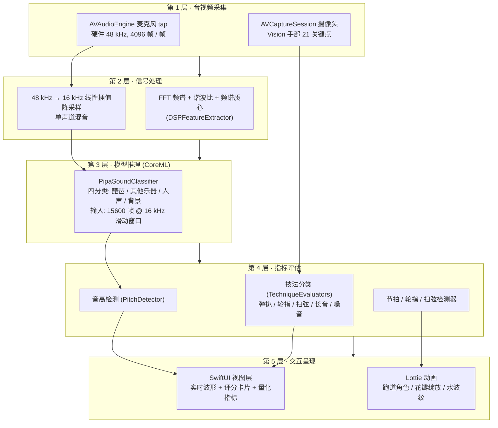

# 弹拨搭子 — AI 琵琶陪练

一款基于端侧 CoreML 的智能琵琶陪练 iOS 应用。摄像头识别手型 + 麦克风识别声音,实时给出指法评分、调音陪伴、节拍陪练,帮助习琴者在家也能练出标准音色与节奏。

> 参赛作品 · 移动应用创新赛（中小学组） · 启航赛道
>
> 开发者:吴泽荟  
> 学校:武汉康礼高级中学

---

## 本项目的技术贡献

项目在以下五个方向做了技术创新与工程取舍。

### 贡献 1 · 音视频多模态融合检测指法

弹拨搭子把 Vision 手部关键点、FFT 频谱与 CoreML 分类器三路信号融合，共同判定弹挑、轮指、扫弦、长音四类指法。

- **音频侧**：Accelerate 框架做 4096 点 FFT，实时测算音高与节奏；同时把 48 kHz 硬件缓冲线性插值降采样到 16 kHz，喂给 CoreML 分类器做"是不是琵琶"的判门
- **视频侧**：Vision 追踪手部 21 个关键点，经卡尔曼滤波平滑后计算虎口角度、手腕高度，作为技法判定的几何特征
- **融合策略**：音频判别"是不是琵琶声"（排除人声 / 环境噪音）；视频判别"手型对不对"；两个都过才进入技法分类，避免单一模态误判

### 贡献 2 · 端侧自训练 CoreML 琵琶声分类器

内置自训练的四分类模型 `PipaSoundClassifier.mlmodel`，输入是 Float32 的 `audioSamples`，长度 15600 帧，约合 16 kHz 采样率下 0.975 秒的窗口，输出四类概率：

| 类别                 | 含义   |
| ------------------ | ---- |
| `pipa`             | 琵琶声  |
| `other_instrument` | 其它乐器 |
| `speech`           | 人声   |
| `background`       | 背景噪声 |

- **端侧推理**：`MLModel.prediction` 跑在 iPhone 神经引擎上，单次推理不到 80 ms
- **零网络依赖**：整个推理在本地完成，不上传任何音频片段
- **工程层精度优化**：不动模型本身，改用阈值 0.35 加 2 帧滑动平均，再加一道能量门控，低 RMS 的安静帧直接判 background，推理步长也从 15600 帧改成 8000 帧形成重叠窗口

### 贡献 3 · 4096 点 FFT + 卡尔曼滤波的实时算法

- **FFT 频谱分析**：`DSPFeatureExtractor.swift` 用 `vDSP_fft_zrip`（Accelerate 加速）做 4096 点 FFT，计算 RMS、谐波比、频谱质心、过零率等指标，作为音高检测和分类器输入特征
- **卡尔曼滤波平滑**：`HandPoseExtractor` 拿到的 21 个关键点每帧都有抖动，直接用会引入噪声；经卡尔曼滤波平滑后，再算虎口角度、手腕高度，能稳定输出虎口张开度数
- **并行处理**：麦克风 4096 帧缓冲和摄像头帧在两条独立线程上采集，互不阻塞；CoreML 推理在 `inferenceQueue` 串行队列上跑，不抢音频主线程

### 贡献 4 · 统一音频管线 + 模型门控架构

iOS 上多个模块都想用麦克风，但 AVAudioEngine 的 tap 只能被一个处理器装上——多模块并发会直接冲突。弹拨搭子的解法：

```
┌──────────────────────────────────────────────────┐
│ AudioManager (单例)                              │
│ ├── AVAudioEngine                                │
│ ├── 4096 帧 tap                                 │
│ └── startListening { buffer in                    │
│     ├─→ 调音: PipaSoundGate (判门) + PitchDetector │
│     ├─→ 弹挑跑步: RhythmDetector                  │
│     ├─→ 轮指花开: RollDetector                    │
│     └─→ 扫弦水波: SweepDetector                  │
│    }                                              │
└──────────────────────────────────────────────────┘
```

- 单一 AVAudioEngine、单一 tap，所有需要音频的模块共享一份缓冲回调
- `PipaSoundGate` 独立加载 `PipaSoundClassifier.mlmodel`，**不接管 AVAudioEngine tap**——它只接管"降采样 + 模型推理"，避免和指法教练的 Engine 抢资源

### 贡献 5 · 全离线端侧五层架构

详细架构图见下一节《系统架构》。核心创新点：

- 五层自下而上依次是音视频采集、信号处理、模型推理、指标评估、交互呈现，每层职责单一、彼此解耦
- 采集、特征提取、推理、评估各跑在独立的队列上，主线程只负责刷新 UI
- 练习录像、评分、排行榜全部写进本地 CoreData，不联网上传，也不从网络下载

---

## 系统架构

采用端侧全离线五层架构,从麦克风 / 摄像头原始数据到 UI 反馈全部在 iPhone 上完成,无任何网络依赖。

各层的模块映射关系如下。



**五层职责说明**

| 层         | 输入              | 输出                  | 关键文件                                                                                                                |
| --------- | --------------- | ------------------- | ------------------------------------------------------------------------------------------------------------------- |
| 1 · 音视频采集 | 用户在 iPhone 前的演奏 | 原始 PCM 流 / 摄像头帧     | `AudioManager.swift`、`CameraManager.swift`                                                                          |
| 2 · 信号处理  | 原始 PCM          | 频谱特征 / 16 kHz 归一化样本 | `DSPFeatureExtractor.swift`、`PipaSoundGate.swift`(降采样)                                                              |
| 3 · 模型推理  | 15600 帧归一化样本    | 4 类别概率分布            | `PipaSoundClassifier.mlmodel`、`PipaSoundGate.swift`(推理)                                                             |
| 4 · 指标评估  | 频谱特征 + 视频关键点    | 音高 / 节拍 / 技法判定      | `PitchDetector.swift`、`RhythmDetector.swift`、`RollDetector.swift`、`SweepDetector.swift`、`TechniqueEvaluators.swift` |
| 5 · 交互呈现  | 指标数据            | 用户可见的 UI 与动画        | 7 个 `*View.swift` 文件 + `Animations/*.json`                                                                          |

**为什么这样分**

- 第 1 层专注采集，所有输入输出集中在一处，避免多个模块争抢 AVAudioEngine 的 tap
- 第 2 层做格式归一，把硬件的 48 kHz 转成模型需要的 16 kHz 15600 帧窗口，下游可以无差别地喂数据
- 第 3 层跑 CoreML 推理，单次不到 80 ms，全程离线
- 第 4 层是演奏领域的判定逻辑，5 个检测器各管一个维度，彼此独立可测
- 第 5 层只负责渲染，SwiftUI 订阅 ViewModel 的 Published 状态，不掺入计算

---

## 核心功能

| 模块         | 说明                                                                          |
| ---------- | --------------------------------------------------------------------------- |
| **智能指法教练** | 摄像头实时识别左右手指型(Vision 框架),匹配琵琶核心 5 种技法(弹挑/轮指/扫弦/长音/噪音),给出连续帧稳定的技法评分与核心要求轮播    |
| **智能调音**   | 麦克风采集琵琶空弦音,自研 FFT 算法给出当前音高与十二平均律标准音的 cents 偏差;接 CoreML 分类器做「先判琵琶声 → 再判音高」门控 |
| **弹挑跑步**   | 节拍跑道游戏化陪练。每完成一次弹挑,角色在跑道上前进一格;统计节拍稳定性 BPM 与总分                                |
| **轮指花开**   | 轮指训练花朵生长可视化。检测连续快速拨弦的均匀度,完成一轮后花瓣绽放                                          |
| **扫弦水波**   | 扫弦训练水波纹可视化。区分上扫/下扫,生成对应方向的水波纹动画                                             |
| **节拍器**    | 独立可调 BPM 节拍器,适配不同练习场景                                                       |
| **社交广场**   | 离线排行榜 / 成就 / 好友 PK(本地持久化,演示用)                                               |
| **欢迎界面**   | 米白底 + Logo + "今天也来练 5 分钟吧" + 3 秒倒计时自动退出 + 右上角"跳过"                           |

---

## 技术栈

- 开发语言是 Swift 6，界面用 SwiftUI，状态绑定用 Combine，并发按 Swift Concurrency 的严格模式编写
- 运行平台为 iOS 17.6 及以上的 arm64 真机，摄像头与麦克风功能必须在真机上演示
- 算法侧用 Accelerate 框架的 vDSP 做 FFT，AVAudioEngine 负责麦克风采集，Vision 负责手部关键点提取
- 声学模型是自训练的 CoreML 四分类模型 PipaSoundClassifier，区分琵琶、其它乐器、人声与背景噪声，全程离线推理
- 音频采集由自写的 AudioManager 统一装 tap，每缓冲 4096 帧，再用线性插值把硬件的 48 kHz 降到 16 kHz
- 手型由 HandPoseExtractor 提取左右手各 21 个关键点，再算出虎口角度与手腕高度
- Lottie 负责扫弦水波与跑道角色动画，CoreData 负责练习记录、排行榜与成就的本地持久化

---

## 项目结构

```
PluckBuddy/
├── PluckBuddy.xcodeproj/        # Xcode 工程
├── PluckBuddy/                   # 主 target 源码
│   ├── PluckBuddyApp.swift       # App 入口(欢迎/首页切换)
│   ├── WelcomeView.swift         # 启动欢迎页(3 秒倒计时淡出)
│   ├── HomeView.swift            # 主页(七大模块入口)
│   ├── TechniqueCoachView*.swift # 智能指法教练 UI + ViewModel
│   ├── TunerView*.swift          # 智能调音 UI + ViewModel
│   ├── RunningViewModel.swift    # 弹挑跑步 ViewModel
│   ├── FlowerPracticeView.swift  # 轮指花开 UI
│   ├── FlowerViewModel.swift     # 轮指花开 ViewModel
│   ├── WavePracticeView.swift    # 扫弦水波 UI
│   ├── WaveViewModel.swift       # 扫弦水波 ViewModel
│   ├── MetronomeView.swift       # 节拍器 UI
│   ├── MetronomeManager.swift    # 节拍器调度
│   ├── FriendPKView.swift        # 社交广场 UI
│   ├── AchievementView.swift     # 成就 UI
│   ├── Persistence.swift         # CoreData 持久化
│   ├── AudioManager.swift        # 统一音频采集
│   ├── PipaSoundClassifier.mlmodel  # 端侧四分类 CoreML 模型
│   ├── PipaSoundGate.swift       # 调音专用琵琶声判门(独立加载模型,避免与指法教练 AVAudioEngine 抢 tap)
│   ├── CameraManager.swift       # 摄像头采集(新旋转 API)
│   ├── HandPoseExtractor.swift   # Vision 手型提取
│   ├── DSPFeatureExtractor.swift # 自研 FFT 频谱特征
│   ├── PitchDetector.swift       # 音高检测
│   ├── RhythmDetector.swift      # 弹挑节拍检测
│   ├── RollDetector.swift        # 轮指检测
│   ├── SweepDetector.swift       # 扫弦检测
│   ├── Animations/               # Lottie 动画 JSON
│   └── Assets.xcassets/          # 资源(Logo 等)
└── PluckBuddyTests/              # 单元测试 target
```

---

## 运行方式

1. **Mac 上 Xcode 17+ 打开** `PluckBuddy.xcodeproj`
2. 左侧工程 → TARGETS `PluckBuddy` → **Signing & Capabilities**
   - **Team** 选你自己的 Apple ID(免费账号即可)
   - **Bundle Identifier** 改成你账号下未注册的(如 `com.你的名字.pluckbuddy`)
3. 连真机 → 顶部设备栏选 iPhone → `Cmd+R`
4. **真机系统要求**:iOS 17.6 或更高
5. **真机首次**:设置 → 隐私与安全性 → 开发者模式 → 打开并重启;跑起来弹「不受信任的开发者」时,设置 → 通用 → VPN 与设备管理 → 信任你的 Apple ID
6. **摄像头 / 麦克风模块**(指法教练 / 调音 / 三个陪练)**必须真机运行**,模拟器无摄像头/麦克风

免费 Apple ID 描述文件 7 天过期,到期需重连 Xcode 重新签名安装。

---

## 已知限制 / 待改进

- 分类器精度仍受训练数据分布限制。若真机 console 显示 `rms > 0.05` 但 `pipa < 0.3`,说明模型对当前麦克风音质判别力不足,需用 Create ML Sound Analysis 模板重训(每类 ≥ 30 条 16kHz 音频,通常 30 分钟内能出一个明显更好的模型)
- 免费 Apple ID 描述文件 7 天过期,需重连 Xcode 重签
- 摄像头 / 麦克风功能必须真机,模拟器无法演示
- 社交广场为离线演示版,排行榜 / 成就 / 好友 PK 数据存储本地 CoreData

---

## License

参赛作品源码,仅供评审与学习使用。
